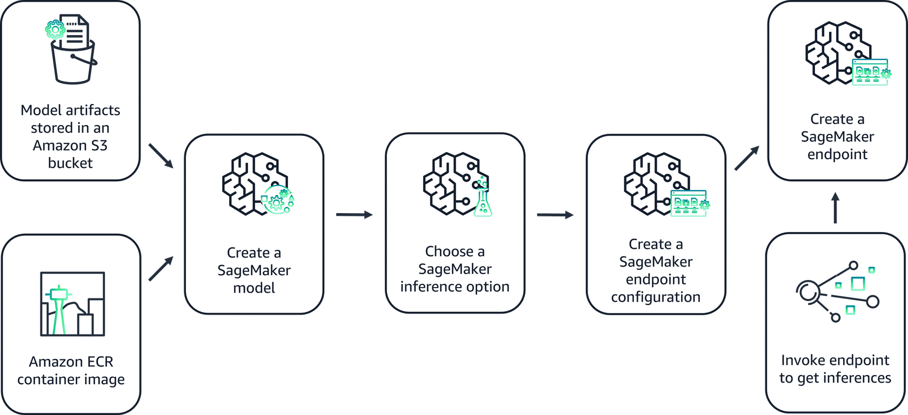

# Deployment Considerations and Target Options

Now that you have an idea of your model deployment workflow, it's time to consider deployment inference infrastructure options. This lesson covers considerations, best practices, and various AWS options for deployment targets.

---

## Deployment Inference Infrastructure Considerations

When designing your inference infrastructure, consider the following factors:

- **Performance**: Optimize model architecture and hyperparameters to ensure efficient computation and maintain prediction performance over time.
- **Availability**: Design the system with redundancy, failover mechanisms, load balancing, and horizontal scaling to ensure continuous service.
- **Scalability**: Use a modular, distributed architecture with auto-scaling and event-driven processing to accommodate increasing workloads.
- **Resiliency**: Incorporate data redundancy and backup mechanisms. Design the system to handle partial failures gracefully and recover automatically.
- **Fault Tolerance**: Implement robust error handling, logging, and self-healing capabilities (e.g., automatic restarts or failovers) to quickly diagnose and recover from issues.

---

## Best Practices for Model Deployment

To achieve effective model deployment, adopt the following best practices:

-   **Apply Auto Scaling**: Use auto scaling to dynamically adjust the number of instances in response to workload changes.
-   **Test Model Variants**: Test new model variants on a subset of production traffic before a full rollout.
-   **Use Batch for Large Datasets**: For getting inferences on entire datasets, use batch transform instead of real-time hosting services.

---

## AWS Deployment Targets

The choice of deployment target depends on factors like scalability, operational overhead, cost, and model complexity.

| Feature | Amazon SageMaker Endpoints | Amazon EKS | Amazon ECS | AWS Lambda |
| :--- | :--- | :--- | :--- | :--- |
| **Management** | Fully managed | Self-managed cluster | Fully managed | Fully managed (Serverless) |
| **Scalability** | Automatic, built-in | Highly scalable, manual config | Automatic, managed | Automatic, event-driven |
| **Flexibility** | Good (various frameworks) | Very high (custom containers) | High (Docker containers) | Limited (by runtime/size) |
| **Cost Model** | Per-instance hour | Per-instance hour (EC2/Fargate) | Per-instance hour (EC2/Fargate) | Pay-per-request/duration |
| **Overhead** | Low | High | Medium | Very Low |
| **Use Case** | General ML, rapid deployment | Complex, custom workflows | Containerized apps, microservices | Lightweight, event-driven tasks |

### Amazon SageMaker Endpoints
- **Description**: A fully managed service to build, train, and deploy ML models at scale.
- **Benefits**: Fully managed, easy to deploy and scale, built-in monitoring, supports various ML frameworks.
- **Considerations**: Less customizable and potentially higher cost than other options.
- **Use Case**: When you want a fully managed solution with minimal operational overhead (e.g., a bank deploying fraud detection models).

### Amazon EKS (Elastic Kubernetes Service)
- **Description**: A powerful container orchestration platform to deploy models as containerized applications.
- **Benefits**: Highly scalable and flexible, supports advanced and custom deployment scenarios.
- **Considerations**: Higher operational overhead and a steeper learning curve.
- **Use Case**: When you need advanced, customized configurations and have the resources to manage a Kubernetes cluster (e.g., a biomedical company processing DNA sequencing data).

### Amazon ECS (Elastic Container Service)
- **Description**: A fully managed container orchestration service for Docker containers.
- **Benefits**: Managed service, easy to scale, integrates well with other AWS services.
- **Considerations**: Limited advanced features compared to Kubernetes, potential for vendor lock-in.
- **Use Case**: When you want a managed container service with good AWS integration and don't need advanced Kubernetes features (e.g., a renewable energy firm scaling solar energy forecasting).

### AWS Lambda
- **Description**: A serverless computing service to run model code without managing servers.
- **Benefits**: Serverless, auto-scaling, low operational overhead, pay-per-use pricing.
- **Considerations**: Limited run time, potential for cold start latency, not suitable for long-running or complex models.
- **Use Case**: For lightweight, low-latency models where a serverless, pay-per-use solution is ideal (e.g., a telehealth company using functions for appointment reminders).

---

## Using SageMaker for Deployment

### Steps for Model Deployment
1.  **Create a SageMaker Model**: Point to model artifacts in an S3 bucket and a container image in ECR.
2.  **Choose an Inference Option**: Select an option, possibly using Inference Recommender for suggestions.
3.  **Create an Endpoint Configuration**: Specify the instance type and number of instances.
4.  **Create an Inference Endpoint**: Create the endpoint and invoke it to get inferences.

### Configuring Endpoints
An endpoint configuration defines the settings for your real-time inference endpoint. Key elements include:

-   **Compute Resources**: Select the instance type. A minimum of two instances is required for high availability.
-   **Scaling Policies**: Define rules for scaling resources up or down based on traffic or other metrics.
-   **Data Capture**: Enable capturing of input data and predictions for debugging, auditing, or compliance.
-   **Deployment Strategies**: Specify how to roll out new model versions and route traffic.
-   **Security and Access Control**: Define permissions, encryption, and network controls.
-   **Monitoring and Logging**: Configure settings to track the performance and health of your model.

### Best Practices with SageMaker
-   **Apply Auto Scaling**: SageMaker supports auto scaling to dynamically adjust the number of instances based on workload, optimizing cost and performance.
-   **Test Model Variants**: Test multiple model versions on the same endpoint to validate improvements on a subset of production traffic.
-   **Use Batch Transform**: For large datasets, use batch transform for efficient, offline inference processing.