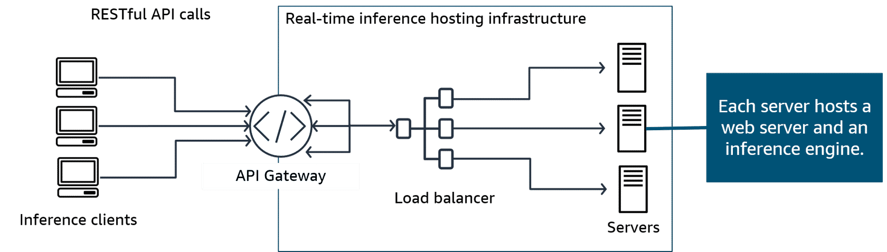
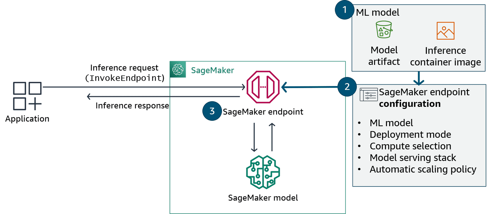
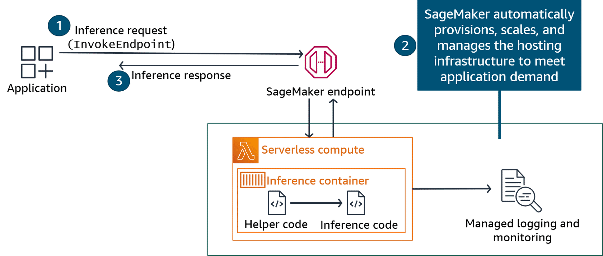
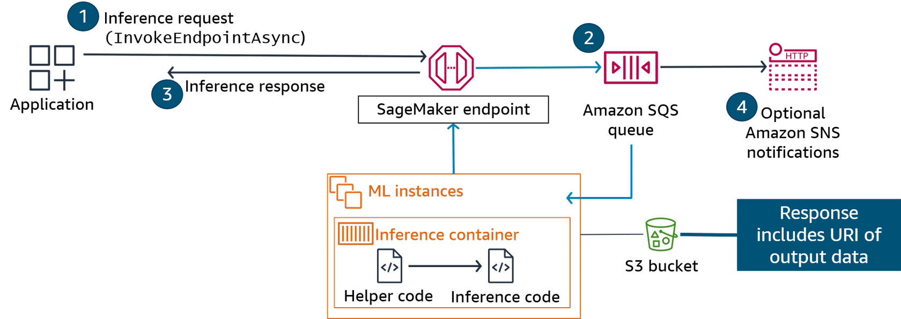
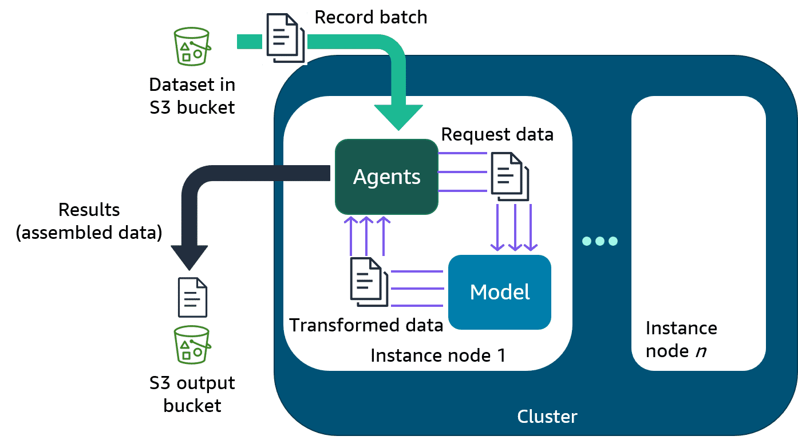
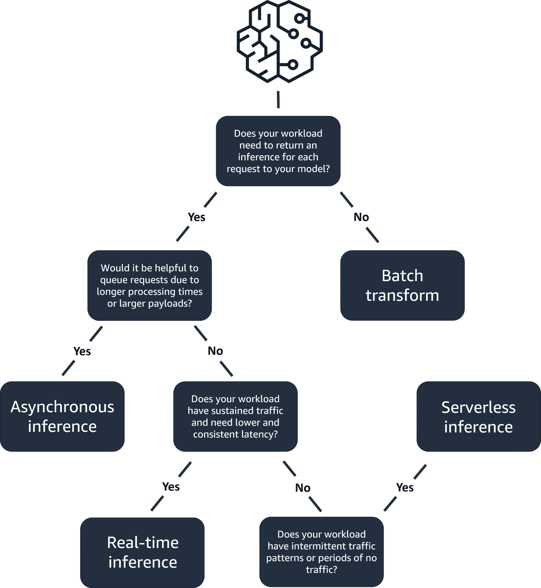
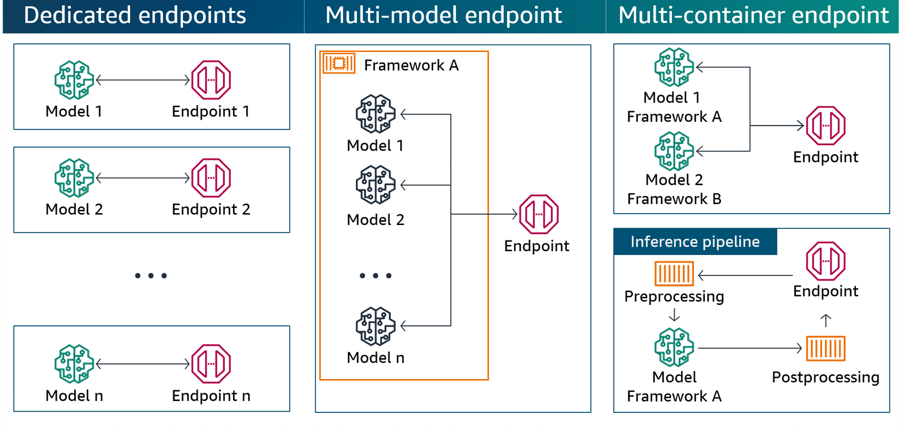

# Choosing a Model Inference Strategy

Choosing the right model inference strategy is important for efficient and effective deployment of your models. Amazon SageMaker provides several options for model inference, each with its own set of advantages and trade-offs.

This lesson explores four SageMaker inference strategies: real-time inference, serverless inference, asynchronous inference, and batch transform. By understanding the differences of each approach, you will be better equipped to select the most suitable strategy for your specific use case.

## Amazon SageMaker Inference Options

SageMaker provides multiple inference options to suit different workloads:

- **Real-time:** For low latency, high throughput requests.
- **Serverless:** Handles intermittent traffic without managing infrastructure.
- **Asynchronous:** Queues requests and handles large payloads.
- **Batch transform:** Processes large offline datasets.

---

## Real-time Inference

Real-time inference is ideal for workloads where you have real-time, interactive, low latency requirements. You can deploy your model to SageMaker hosting services and get an endpoint that can be used for inference. These endpoints are fully managed and support auto scaling.

### Sample Real-time Hosting Inference Architecture

In this architecture, you manage the deployment and configuration of infrastructure components manually.

- An **API gateway** provides an endpoint for RESTful API calls, securing, monitoring, and managing traffic.
- A **load balancer** distributes traffic between multiple servers.

To create the SageMaker endpoint:

1.  Create a SageMaker model by specifying the model artifact and inference container image.
2.  Define the SageMaker endpoint configuration.
3.  Create the SageMaker endpoint.

.png)
SageMaker then provisions the infrastructure that hosts the model, deploying EC2 instances to host inference containers.

---

## Serverless Inference

With serverless inference, you can deploy and scale ML models without configuring or managing the underlying infrastructure. You specify the amount of memory and number of concurrent requests, and SageMaker automatically provisions the required resources.

### Options for Balancing Cost and Performance

- **On-demand Amazon SageMaker Serverless Inference:** Ideal for workloads with idle periods. It automatically scales resources, and you pay per use. It scales down to zero during inactive periods to minimize costs.
- **Provisioned Concurrency with Serverless Inference:** Cost-effective for predictable traffic bursts. You define a minimum capacity to keep endpoints warm and ready to respond within milliseconds.

### Sample Serverless Hosting Inference Architecture

An application makes inference requests to a SageMaker serverless endpoint. The request travels to an inference container on serverless compute resources, and the response is sent back to the application.

---

## Asynchronous Inference

Asynchronous inference queues incoming requests and processes them asynchronously. This option is ideal for requests with:

- Large payload sizes (up to 1 GB)
- Long processing times (up to 1 hour)

### Auto Scaling

You can save costs by auto-scaling the instance count to zero when there are no requests to process, so you only pay when your endpoint is active.

### Sample Asynchronous Hosting Inference Architecture

1.  To create an endpoint, specify the `AsyncInferenceConfig` object in your endpoint configuration.
2.  To invoke it, place the request payload in Amazon S3 and provide the S3 URL.
3.  SageMaker uses Amazon SQS to queue the request and returns an identifier and output location.
4.  After processing, the result is placed in the specified S3 location. You can receive notifications via Amazon SNS.

---

## Batch Transform

Batch transform provides offline inference for large datasets. It's useful for preprocessing data, gaining insights from large datasets, or running inference when a persistent endpoint isn't needed.

### Use Cases for Batch Transforms

- Preprocess datasets to remove noise or bias.
- Get inferences from large datasets.
- Run inferences without a persistent endpoint.
- Associate input records with inferences to interpret results.

### Sample Batch Transform Flow

To perform a batch transform, create a job and provide:

- The S3 bucket path for your data.
- The compute resources for the job.
- The S3 bucket path for the output.
- The name of the SageMaker model.

Batch transform manages all compute resources, including launching and deleting instances after the job is complete.

---

## Choosing an Inference Option for Your Use Case

1.  **Does your workload need an inference for each request?**
    - **No:** Use **Batch Transform** for offline processing of large datasets.

2.  **Is it helpful to queue requests due to long processing times or large payloads?**
    - **Yes:** Use **Asynchronous Inference** for large inputs (up to 1 GB) and long processing times (up to 1 hour).

3.  **Does your workload have intermittent or unpredictable traffic?**
    - **Yes:** Use **Serverless Inference**. It handles infrastructure and auto-scaling, and you only pay for what you use.

4.  **Does your workload have sustained traffic and need low, consistent latency?**
    - **Yes:** Use **Real-time Inference** for online predictions with high throughput. It supports payloads up to 6 MB and processing times up to 60 seconds.

---

## Multi-model and Multi-container Deployments

For complex use cases, you might need to deploy multiple models or containers. AWS provides options to optimize infrastructure and resource utilization.

- **Multiple Model:** Hosts multiple models with a shared serving container to reduce hosting costs.
- **Multiple Container:** Deploys multiple containers, uses multiple frameworks, and allows direct invocation.

### Endpoint Options for Deploying Multiple Models

If you have underutilized endpoints, you can combine models or containers into a single endpoint to improve your return on investment.

### Use Cases for Multi-model Endpoints

- **A/B testing:** Host different model versions side-by-side to compare performance.
- **Ensemble model:** Host an ensemble of models that specialize in different parts of a problem.
- **Dynamic model loading:** Load specific models only when needed to save resources.
- **Multi-tenant applications:** Serve multiple customers, each with their own unique model, from a single endpoint.

### Use Cases for Multi-container Endpoints

- **Data preprocessing:** Run a preprocessing container alongside your model container.
- **Post-processing and interpretation:** Use a post-processing container to generate explanations or format output.
- **Multi-modal inference:** Use specialized containers for different data modalities.
- **Complex workflows:** Break down a pipeline into modular, reusable components to improve maintainability and scalability.