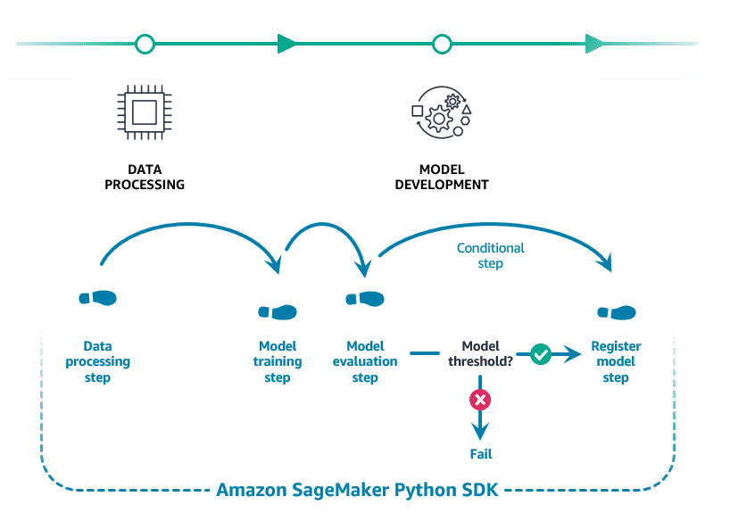
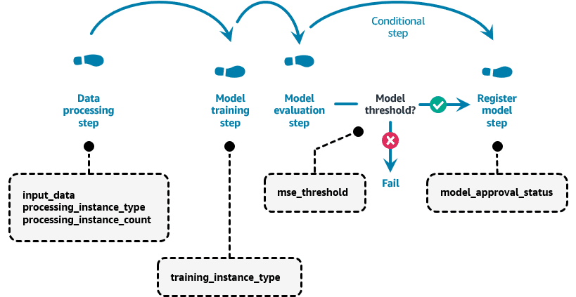
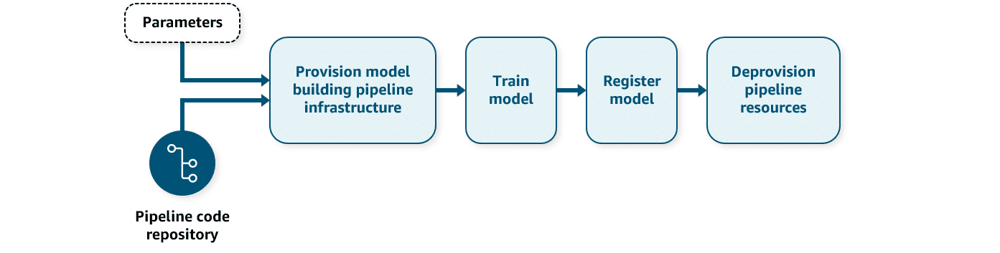

# Key Concepts: SageMaker Python SDK for Senior ML Engineers

The SageMaker Python SDK is a high-level, open-source library for training and deploying machine learning models on Amazon SageMaker. For a senior engineer, it's the primary tool for implementing MLOps practices like automation, reproducibility, and production-grade deployments.

---

### 1. Infrastructure as Code (IaC) for the ML Lifecycle



The SDK allows you to define your entire ML workflow—from data processing to model deployment—in Python. This enables:
- **Automation**: Script the entire process, reducing manual intervention.
- **Reproducibility**: Ensure that pipelines are version-controlled and can be re-run consistently.
- **Efficiency**: Abstract away low-level infrastructure details, allowing focus on the ML logic.

### 2. SageMaker Pipelines: Orchestrating Workflows

`SageMaker Pipelines` is the core component for building and managing multi-step ML workflows.



- **Pipeline Definition**: Use the `Pipeline` class to chain together a series of steps. This creates a directed acyclic graph (DAG) of your workflow.
- **Parameterization**: Define `Parameters` (e.g., for instance types, data paths, or evaluation thresholds) to make pipelines reusable and configurable for different runs without changing the code.
- **Standard Steps**: The SDK provides pre-built step classes for common tasks:
  - `ProcessingStep`: For data preparation, feature engineering, and model evaluation.
  - `TrainingStep`: For model training.
  - `ConditionalStep`: For implementing conditional logic, such as registering a model only if its accuracy exceeds a certain threshold.

**Example: Defining a Pipeline**
```python
pipeline = Pipeline(
    name="MyMLPipeline",
    parameters=[...],
    steps=[step_process, step_train, step_conditional]
)
```

### 3. Modular Components for Processing and Training

The SDK uses a class-based approach to encapsulate specific jobs.

- **Processors (`SKLearnProcessor`, `PySparkProcessor`)**: Define data processing jobs. You specify the framework, instance configuration, and a processing script. The processor handles moving data to and from S3.

- **Estimators (`XGBoost`, `PyTorch`, `TensorFlow`)**: Define training jobs. Estimators abstract the training process, managing the training script, framework versions, hyperparameters, and distributed training configurations. They are tightly integrated with `HyperparameterTuner` for automated model tuning.

**Example: Defining an Estimator**
```python
from sagemaker.xgboost import XGBoost

xgb_estimator = XGBoost(
    entry_point="train.py",
    instance_type="ml.m5.xlarge",
    framework_version="1.5-1",
    ...
)

xgb_estimator.fit({"train": train_input})
```

### 4. Flexible Model Deployment Strategies

The SDK simplifies deploying models as scalable, production-ready endpoints.

- **`.deploy()` Method**: A simple method on an estimator or model object to create an endpoint. It handles creating the endpoint configuration and deploying the model.

- **Serverless Inference**: For models with intermittent or unpredictable traffic, `ServerlessInferenceConfig` allows you to deploy endpoints that automatically scale from zero to handle requests, optimizing costs.

- **`Model` Class**: For more advanced deployment scenarios, you can use framework-specific `Model` classes (e.g., `PyTorchModel`, `MXNetModel`). This gives you fine-grained control, allowing you to package a pre-trained model artifact (from S3) with custom inference code (`inference.py`).

**Example: Deploying with Serverless Configuration**
```python
from sagemaker.serverless import ServerlessInferenceConfig

serverless_config = ServerlessInferenceConfig(
    memory_size_in_mb=4096, max_concurrency=10
)

predictor = xgb_estimator.deploy(
    serverless_inference_config=serverless_config
)
```

### 5. Full CI/CD Automation

The SageMaker Python SDK is the cornerstone of a fully automated MLOps workflow:



1.  **Code Repository**: Store your SageMaker pipeline definition code in a Git repository.
2.  **CI/CD Trigger**: A CI/CD system (like AWS CodePipeline or Jenkins) triggers the pipeline on events like a `git push`.
3.  **Pipeline Execution**: The CI/CD tool executes the Python script, which uses the SDK to create or update and then run the SageMaker Pipeline.
4.  **Model Registration**: If the trained model meets quality gates, the pipeline automatically registers it in the **SageMaker Model Registry**.
5.  **Resource Management**: The CI/CD process can automatically de-provision pipeline resources upon completion to control costs.


