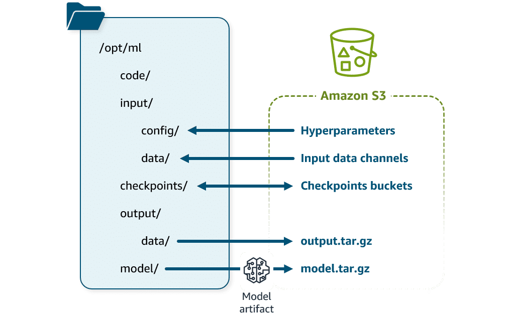

# Key Concepts: Building and Maintaining Containers for ML on AWS

For a Senior ML Engineer, containers are the fundamental building blocks for creating reproducible, scalable, and portable machine learning systems. This document outlines the core principles of using containers with Amazon SageMaker and the broader AWS ecosystem.

---

### 1. The SageMaker Container Contract

SageMaker enforces a standardized structure for its training and inference containers to automate the ML lifecycle. Adhering to this "contract" is crucial for custom container development.

#### Training Container Structure

The container must expect a specific directory layout under `/opt/ml`. SageMaker uses this to manage I/O.



-   **/opt/ml/input/config/**: Contains `hyperparameters.json` and `resourceconfig.json`. This is how SageMaker passes runtime configurations to your training script.
-   **/opt/ml/input/data/<channel_name>/**: Data for each named input channel is mounted here. Your script reads from these directories.
-   **/opt/ml/model/**: Your training script **must** write the final, trained model artifacts to this directory. SageMaker automatically tars and uploads the contents to S3 as `model.tar.gz` upon successful completion.
-   **/opt/ml/output/data/**: For any non-model artifacts (e.g., evaluation reports, transformed data) that need to be saved to S3.
-   **/opt/ml/code/**: The location where your training script(s) are placed.

#### Inference Container Contract

An inference container must function as a self-contained microservice.

.png)

-   **Web Server**: It must run a web server (e.g., Flask, FastAPI, TorchServe) listening on port `8080`.
-   **API Endpoints**: It must implement two specific endpoints:
    -   `POST /invocations`: The endpoint for receiving prediction requests. The request body format is defined by you, and the container's logic handles deserialization, prediction, and serialization of the response.
    -   `GET /ping`: A health check endpoint that SageMaker calls to ensure the container is responsive. It should return an HTTP `200 OK` status.
-   **Model Loading**: The container must load the model from the `/opt/ml/model` directory, where SageMaker automatically places the extracted `model.tar.gz` artifact.
-   **Executable**: The `Dockerfile` must define an `ENTRYPOINT` or `CMD` to start the web server.

**Example `Dockerfile` Entrypoint:**
```dockerfile
ENTRYPOINT ["python", "serve.py"]
```

### 2. The Container Management Stack on AWS

Beyond building the image, a senior engineer must make architectural decisions about the container management lifecycle.

.png)

#### A. Registry: Storing and Versioning Images

-   **Amazon Elastic Container Registry (ECR)**: This is the standard, fully-managed AWS service for storing Docker images. It's secure, scalable, and tightly integrated with IAM and other AWS services like SageMaker, ECS, and EKS. All your custom training and inference images should be versioned and stored here.

#### B. Orchestration: Managing Container Lifecycle

This is about how containers are deployed, scaled, and managed.

-   **Amazon SageMaker**: Provides high-level, managed orchestration specifically for ML workloads. When you start a training job or deploy an endpoint, you specify the ECR image URI, and SageMaker handles the rest (provisioning compute, pulling the image, managing the lifecycle). **This is the preferred choice for most ML applications on AWS.**
-   **Amazon ECS (Elastic Container Service)**: A general-purpose container orchestrator. You might choose ECS if you need to run non-SageMaker services alongside your ML models or require more complex networking configurations.
-   **Amazon EKS (Elastic Kubernetes Service)**: The managed Kubernetes service on AWS. This is the right choice if your organization has an existing investment in Kubernetes tooling and expertise, or if you need the advanced flexibility and ecosystem of the Kubernetes platform.

#### C. Hosting: The Compute Layer

This is the underlying compute that runs your containers.

-   **Amazon EC2**: Provides maximum control. You choose the instance family (e.g., GPU-accelerated for training, CPU-optimized for inference) and manage the scaling of the underlying cluster. This is the standard for SageMaker training and hosting.
-   **AWS Fargate**: A serverless compute engine for containers (used with ECS or EKS). You define the CPU and memory your container needs, and Fargate runs it without you managing any servers. This is an excellent choice for inference endpoints with sporadic traffic or for abstracting away infrastructure management, though it may not support specialized hardware like GPUs as flexibly as EC2.
