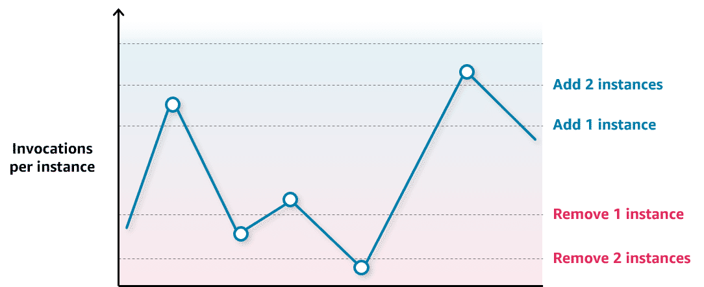

# Key Concepts: Auto Scaling SageMaker Inference Endpoints

For a Senior ML Engineer, designing an effective auto-scaling strategy is critical for balancing cost, performance, and reliability of production ML models. Amazon SageMaker provides a robust set of tools to automate this process.

---

### 1. The Core Principle: Balancing Cost and Performance

Auto scaling for inference endpoints addresses two primary concerns:

-   **Performance**: Prevents high latency and request failures by provisioning enough instances to meet demand.
-   **Cost**: Avoids paying for idle resources by de-provisioning instances when they are not needed.

A key prerequisite is **load testing**, which helps identify the primary saturation metric (e.g., `CPUUtilization`, `MemoryUtilization`, or a custom metric like `InvocationsPerInstance`) and the maximum load a single instance can handle before performance degrades.

### 2. Choosing the Right Scaling Policy

SageMaker offers a spectrum of scaling policies. The choice depends on the predictability and nature of your workload.

#### A. Target Tracking Scaling

This is the simplest and most common approach. You define a target value for a specific metric, and SageMaker automatically adjusts the instance count to keep the average metric value at or near the target.

-   **Use Case**: Ideal for workloads that fluctuate but don't have extremely sharp, unpredictable spikes.
-   **Key Metric**: While `CPUUtilization` is a common choice, `SageMakerVariantInvocationsPerInstance` is often a superior metric as it directly measures the load on the model, independent of instance type.
-   **Implementation**: Define a `TargetValue` and the `CustomizedMetricSpecification` for the metric you want to track.

**Example: Target 70 invocations per instance**
```json
{
     "TargetValue": 70.0,
     "CustomizedMetricSpecification": {
          "MetricName": "InvocationsPerInstance",
          "Namespace": "AWS/SageMaker",
          "Dimensions": [...],
          "Statistic": "Average"
     }
}
```

#### B. Step Scaling



Step scaling provides more granular, aggressive control. You define specific CloudWatch alarms that trigger scaling actions based on metric thresholds.

-   **Use Case**: Best for handling spiky traffic where you need a more immediate and forceful scaling response than target tracking might provide.
-   **Implementation**: Create multiple policies that define how many instances to add or remove when a metric crosses a certain threshold. For example:
    -   If `InvocationsPerInstance > 100`, add 3 instances.
    -   If `InvocationsPerInstance > 75`, add 1 instance.
    -   If `InvocationsPerInstance < 20`, remove 2 instances.

#### C. Scheduled Scaling


This policy scales your endpoint based on a predictable, time-based schedule.

-   **Use Case**: Perfect for workloads with known cyclical patterns (e.g., high traffic during business hours, low traffic overnight and on weekends). It is a powerful cost-optimization tool.
-   **Implementation**: Define a recurring schedule (using a cron expression) or a one-time event, specifying the desired minimum, maximum, and desired instance counts for that time window.

#### D. On-Demand (Manual) Scaling

This involves manually adjusting the instance count.

-   **Use Case**: Reserved for exceptional, unpredictable events where automated scaling might not be sufficient or appropriate, such as a major product launch, a flash sale, or initial capacity planning before traffic patterns are known.

### 3. High Availability by Default

An important architectural benefit is that SageMaker auto-scaling automatically distributes endpoint instances across multiple **Availability Zones (AZs)**. This provides built-in resilience against an outage in a single AZ, a critical feature for production-grade applications.