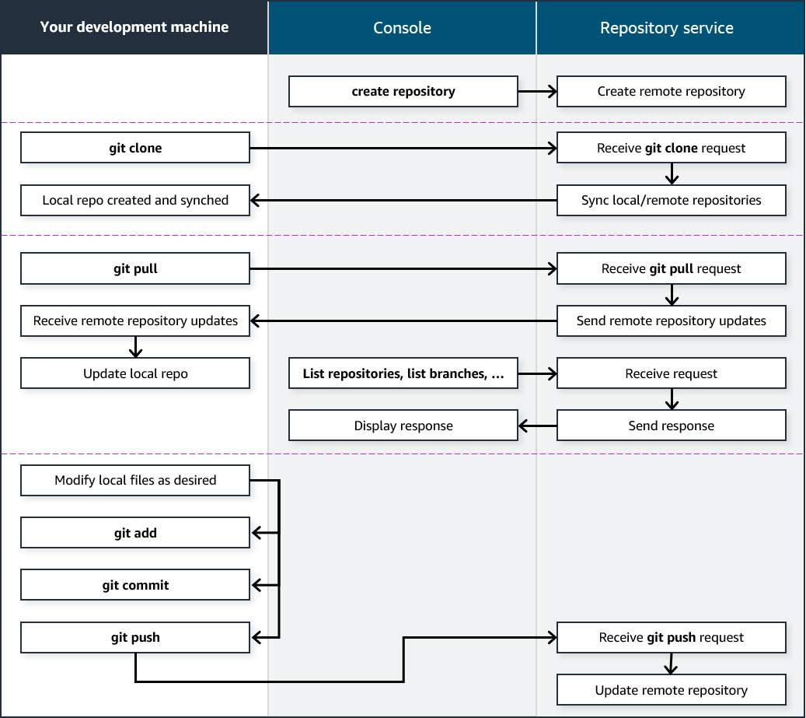

# Key Concepts: The Role of Code Repositories in MLOps

For a Senior ML Engineer, the code repository (e.g., Git) is the cornerstone of an MLOps practice. It is the **single source of truth** not just for application code, but for every artifact required to build, train, and deploy an ML model. It is the primary trigger for all automation.

---

### 1. What Belongs in an MLOps Code Repository?

An MLOps repository is more comprehensive than a traditional software repository. It must contain all the version-controlled artifacts that define the ML system:

-   **Source Code**:
    -   `training/`: Python scripts for model training and evaluation.
    -   `inference/`: The application code for serving the model (e.g., a Flask app in a Docker container).
    -   `preprocessing/`: Scripts for feature engineering and data transformation.
-   **Infrastructure as Code (IaC)**:
    -   `iac/` or `cdk/`: AWS CDK or CloudFormation templates to define all necessary AWS resources (S3 buckets, SageMaker endpoints, IAM roles, etc.).
-   **CI/CD Pipeline Definitions**:
    -   `buildspec.yml`: The build specification for AWS CodeBuild.
    -   `Jenkinsfile`, `.github/workflows/`: Pipeline definitions for other CI/CD tools.
-   **Containerization Artifacts**:
    -   `Dockerfile`: Defines the environment for training and inference containers to ensure consistency.
-   **Configuration Files**:
    -   `config/`: YAML or JSON files specifying model hyperparameters, training instance types, and other environment-specific settings.

**What does *not* belong in the repository?** Large data files, trained model binaries, or secrets. These should be stored in services like Amazon S3, a Model Registry, and AWS Secrets Manager, respectively.

### 2. The Repository as the Engine of MLOps Automation

The code repository is not a passive storage location; it is the active trigger for the entire MLOps workflow. This is accomplished through **webhooks**.

1.  **The Trigger Event**: A developer executes a `git push` command, sending new code to the repository (e.g., AWS CodeCommit, GitHub, GitLab).

2.  **The Webhook**: The repository automatically sends a notification (a webhook payload) to a predefined endpoint. In AWS, this endpoint is typically the **AWS CodePipeline** service.

3.  **Pipeline Invocation**: CodePipeline receives the webhook, recognizes that a change has occurred on a specific branch (e.g., `main`), and automatically starts a new execution of the CI/CD pipeline.

4.  **The Source Stage**: The very first action the pipeline takes is to clone the repository and check out the specific commit that triggered the execution. This ensures that the entire pipeline run—from building containers to training and deploying the model—uses the exact version of the code from that commit, guaranteeing **reproducibility**.

### 3. A Typical Pipeline's Interaction with the Repository

Once invoked, the CI/CD pipeline uses the checked-out code to perform its stages:

-   **Build Stage**: The pipeline uses the `Dockerfile` from the repo to build a new Docker image and the `buildspec.yml` to define the commands to run (e.g., `pip install`, `docker build`).
-   **Test Stage**: The pipeline uses `pytest` to run unit tests located in the `tests/` directory of the repo.
-   **Deployment Stage**: The pipeline uses the IaC templates (e.g., CDK code) from the repo to provision or update the necessary infrastructure for the model.

### 4. Security and Access Control: A Senior Engineer's Responsibility

-   **Authentication**: Access to the repository must be secured. This is managed through IAM users/roles and their associated HTTPS credentials (for AWS CodeCommit) or SSH keys. All communication must be over an encrypted channel (TLS).
-   **Authorization**: As a senior engineer, you must enforce the principle of least privilege. Use IAM policies to define precisely who can read from (clone) and write to (push) specific repositories and branches. For example, only senior engineers or an automated CI/CD process should be allowed to push to the `main` or `production` branch.
-   **Data Protection**: The repository itself should encrypt its contents at rest. Sensitive information like API keys or database passwords must **never** be hardcoded. They should be managed through a service like AWS Secrets Manager and fetched by the pipeline at runtime.