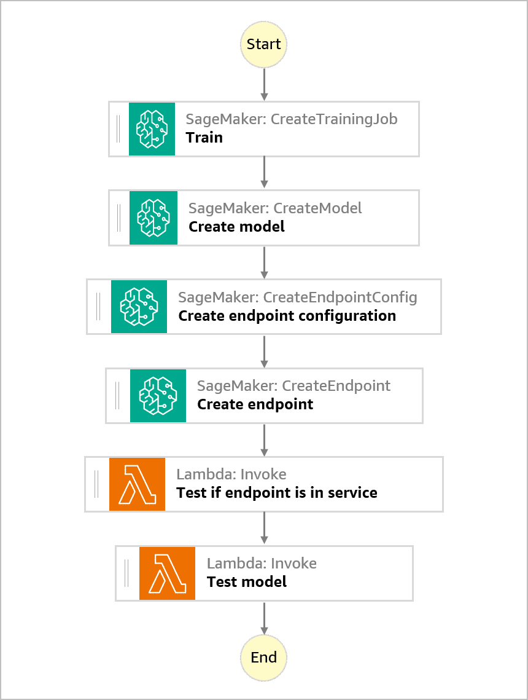
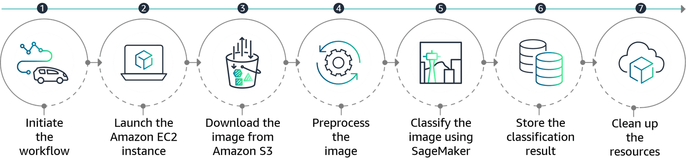
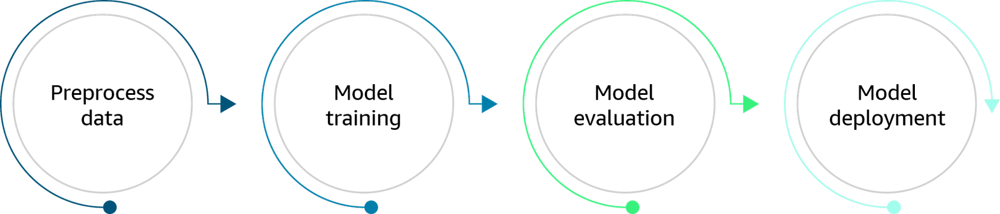

# Key Concepts: Orchestrating MLOps with Step Functions & CodePipeline

For a Senior ML Engineer, building an automated MLOps pipeline requires choosing the right orchestration tools. On AWS, **AWS Step Functions** and **AWS CodePipeline** are two fundamental services that, when used together, create a powerful, event-driven system for CI/CD for Machine Learning.

It's crucial to understand their distinct roles:
-   **CodePipeline**: A CI/CD service for automating your *software release process*. Its job is to move code from a source repository through build, test, and deployment stages.
-   **Step Functions**: A serverless workflow orchestration service. Its job is to coordinate multiple steps, manage state, and handle errors within a complex, distributed application or data processing workflow.

---

### 1. The Architectural Pattern: A Pipeline of Pipelines

The most effective way to combine these services for MLOps is to use CodePipeline to orchestrate the *outer loop* (the software delivery process) and Step Functions to orchestrate the *inner loop* (the complex ML-specific workflows like training and evaluation).

#### AWS CodePipeline: The CI/CD Release Manager

Think of CodePipeline as the manager of your MLOps release process. It models the high-level stages of software delivery.

-   **Source Stage**: Triggered by a `git push` to a specific branch in AWS CodeCommit or GitHub.
-   **Build Stage**: Uses AWS CodeBuild to run unit tests, lint code, and build necessary artifacts (e.g., Docker containers for training/inference).
-   **Deploy/Invoke Stage**: This is the key integration point. Instead of deploying a traditional web app, this stage's primary action is to **start an execution of a Step Functions state machine**, passing in parameters like the commit ID or the location of the newly built container image.

#### AWS Step Functions: The ML Workflow Orchestrator

Think of Step Functions as the detailed, technical orchestrator for your ML tasks. It defines the Directed Acyclic Graph (DAG) of your ML workflow as a **state machine**.

-   **Visual & Serverless**: It provides a visual representation of your workflow, making complex processes easier to design and debug.
-   **State Management**: It manages the state between each step, passing the output of one step as the input to the next.
-   **Error Handling & Retries**: Provides robust, built-in mechanisms to catch errors in any step and automatically retry failed tasks, which is critical for long-running training jobs.
-   **Direct Service Integrations**: It can directly invoke over 200 AWS services, including SageMaker (`createTrainingJob`, `createModel`), Lambda, Glue, and Batch, without writing glue code.

#### Example: Image Classification Workflow

To illustrate, consider a workflow to process and classify images using a pre-trained model. Step Functions can orchestrate this entire process:

1.  **Initiate Workflow**: The process is triggered by a new image being uploaded to an S3 bucket.
2.  **Launch EC2 Instance**: The first step launches an EC2 instance to perform the processing.
3.  **Download Image**: The instance downloads the new image from S3.
4.  **Preprocess Image**: The instance resizes, normalizes, or performs feature extraction on the image.
5.  **Classify Image**: The preprocessed image is sent to a SageMaker endpoint for classification.
6.  **Store Result**: The classification result is stored in a DynamoDB table.
7.  **Clean Up**: The EC2 instance is stopped, and any temporary resources are removed.

### 2. A Concrete MLOps Workflow Example

This pattern brings the concepts of CI, CT, and CD to life:

1.  **CI (Continuous Integration)**: A data scientist pushes new training script code to the `main` branch.
    -   **CodePipeline** triggers, runs `CodeBuild` to execute unit tests, and builds a new training container, pushing it to Amazon ECR with the git commit hash as the tag.

2.  **CT (Continuous Training)**: The final stage of the CodePipeline invokes a **Step Functions** state machine for training.
    -   The state machine executes the following sequence:
        1.  **Start Training**: A `Task` state calls the SageMaker API to start a training job, using the container URI passed in from CodePipeline.
        2.  **Wait for Completion**: A `Wait` state polls until the training job is complete.
        3.  **Evaluate Model**: A `Task` state runs a SageMaker Processing Job or Lambda function to evaluate the new model against a test set.
        4.  **Check Accuracy (Choice State)**: A `Choice` state checks if the model's accuracy (from the evaluation step) is `>=` a predefined threshold (e.g., 95%).
        5.  **Register or Fail**: 
            -   If `True`, a `Task` state registers the model in the SageMaker Model Registry.
            -   If `False`, the workflow proceeds to a `Fail` state, notifying the team.

3.  **CD (Continuous Deployment)**: A separate CodePipeline, triggered by the successful registration of a new model version in the Model Registry, would then manage the deployment of that model to staging and production endpoints.

### 3. Why This Combination is Powerful for Senior Engineers

-   **Separation of Concerns**: It cleanly separates the *software delivery* process (CodePipeline) from the *ML workflow execution* (Step Functions). This makes the system easier to understand, maintain, and scale.
-   **Serverless & Scalable**: Both services are fully managed and serverless, eliminating infrastructure overhead.
-   **Resilience**: The built-in error handling and retry logic of Step Functions make your long-running ML pipelines robust and fault-tolerant.