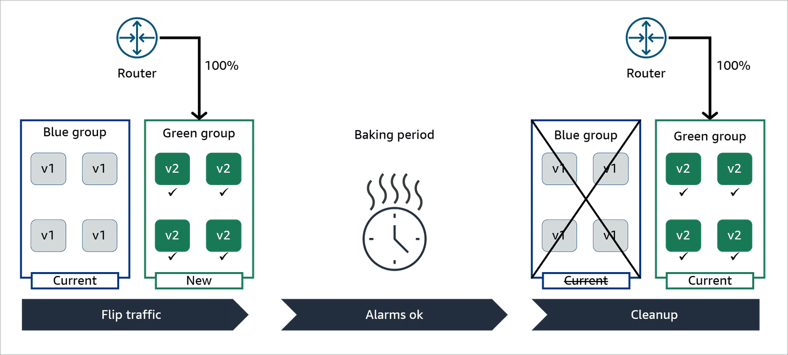
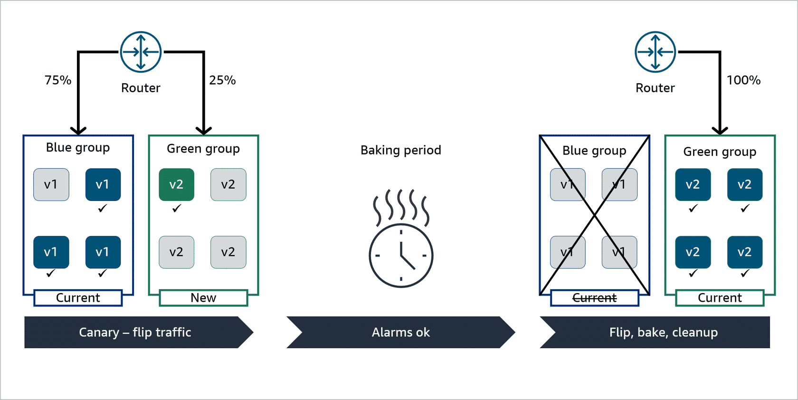

# Key Concepts: SageMaker Deployment Strategies for MLOps

For a Senior ML Engineer, deploying a new model into production is one of the highest-risk phases of the ML lifecycle. A robust deployment strategy is essential to minimize downtime, mitigate risk, and ensure a new model performs as expected on live traffic. Amazon SageMaker provides several advanced deployment guardrails to manage this process.

---

### 1. The Core Principle: Gradual, Monitored Rollouts

The fundamental goal of a safe deployment is to avoid a "big bang" release where 100% of traffic is switched to a new, untested model version at once. Instead, we gradually expose the new model to production traffic while closely monitoring its performance. If issues arise, we can quickly roll back.

### 2. SageMaker Deployment Strategies

SageMaker offers three primary strategies for updating an endpoint, each with different trade-offs in terms of cost, safety, and speed.

#### A. Blue/Green Deployments

This is the most comprehensive and safest deployment strategy. It involves provisioning an entirely new, parallel fleet of instances for the new model version (the "green" fleet) alongside the existing version (the "blue" fleet).

-   **How it works**: You maintain two separate, identical production environments. Traffic is shifted from the blue fleet to the green fleet according to a defined policy.
-   **Key Feature: The Baking Period**: After traffic is shifted, SageMaker waits for a specified "baking period." During this time, CloudWatch alarms monitor the green fleet's health (e.g., latency, error rates, CPU utilization). If any alarm is triggered, the deployment is automatically rolled back, and traffic returns to the blue fleet.

-   **Traffic Shifting Modes**:
    -   **All-at-once**: 100% of traffic moves to the green fleet in a single step. The baking period is the only safety net.
    -   **Canary**: A small percentage of traffic (e.g., 10%) is shifted to the green fleet. After a successful baking period, the remaining 90% is shifted.
    -   **Linear**: Traffic is shifted in multiple, equal increments (e.g., 20% every 10 minutes), with a baking period after each step.
-   **Cost Implication**: This is the most expensive strategy, as you are paying for two full production fleets for the duration of the deployment and baking period.
-   **Senior Perspective**: Use Blue/Green for your most critical, high-traffic endpoints where minimizing risk is the absolute top priority.

#### B. Rolling Deployments

A rolling deployment updates the endpoint in-place by gradually replacing old instances with new ones in configurable batches.

-   **How it works**: SageMaker takes a batch of instances out of service, terminates them, and replaces them with instances running the new model version. This process repeats until the entire fleet is updated.
-   **Key Difference from Blue/Green**: It does *not* provision a second, parallel fleet. It updates the existing one.
-   **Cost Implication**: This is more cost-effective than Blue/Green because it avoids doubling the instance count.
-   **Risk Profile**: It's slightly riskier. If a problem occurs mid-deployment, you have a mixed fleet of old and new model versions serving traffic, which can complicate rollbacks.
-   **Senior Perspective**: Use Rolling Deployments when you need a balance between safety and cost, especially for large endpoints where a full Blue/Green deployment would be prohibitively expensive.

#### C. Canary Deployments (via Production Variants)

This is a more manual but highly flexible approach that uses SageMaker's core feature of routing traffic between different **Production Variants** on the same endpoint.

-   **How it works**: You update your endpoint to include a new production variant for your new model version and assign it a small percentage of the traffic weight (e.g., 5%). The existing model remains as another variant with the remaining weight (95%).
-   **Manual Monitoring & Rollout**: You are responsible for monitoring the performance of the new canary variant. If it performs well, you can manually issue subsequent updates to gradually increase its traffic weight until it reaches 100%.
-   **Rollback**: To roll back, you simply update the endpoint again, setting the traffic weight of the new variant to 0%.
-   **Senior Perspective**: This is the go-to strategy for A/B testing models. It allows you to compare the business performance (e.g., click-through rate, conversion rate) of two different models on live traffic before committing to a full rollout.

### Summary: Choosing the Right Strategy

| Strategy              | Primary Use Case                               | Cost      | Safety    | Speed     |
| --------------------- | ---------------------------------------------- | --------- | --------- | --------- |
| **Blue/Green**        | Mission-critical endpoints, maximum safety     | Highest   | Highest   | Slowest   |
| **Rolling**           | Cost-sensitive, large-scale endpoints          | Medium    | Medium    | Medium    |
| **Canary (Variants)** | A/B testing, fine-grained manual control       | Lowest    | High      | Variable  |