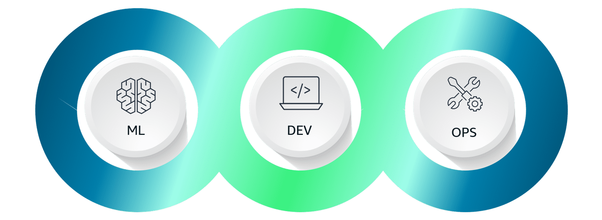

# Key Concepts: Introduction to MLOps for Senior Engineers

MLOps is the application of DevOps principles to the machine learning lifecycle. For a senior engineer, it's not just about automation; it's a strategic framework for building robust, scalable, and reliable ML systems. It addresses the core challenge that **ML is not just code**—it's code, models, and data, all of which evolve independently and must be managed.

---

### 1. Why MLOps is Different from DevOps

While MLOps borrows heavily from DevOps, it introduces unique complexities that senior engineers must manage:

-   **Dual Components**: A traditional CI/CD pipeline manages a single, version-controlled artifact: **code**. An MLOps pipeline must manage at least two: **code** (for training/inference) and the **trained model** itself. In reality, it also manages the **data** used for training.
-   **Experiment-Driven**: ML development is highly iterative and experimental. MLOps must support rapid experimentation while ensuring reproducibility and traceability.
-   **Model Decay**: Unlike traditional software, ML models degrade over time as the production data they see (inference) drifts away from the data they were trained on. MLOps must include processes for monitoring this decay and triggering retraining.

### 2. The MLOps-Enabled CI/CD Pipeline

A mature MLOps pipeline extends the traditional CI/CD concept to the entire ML lifecycle. It's a pipeline of pipelines.

1.  **CI: Code and Component Integration**
    -   **Trigger**: A `git push` to the code repository.
    -   **Actions**: Linting, unit testing, and building/publishing new container images for training or inference.
    -   **Key Artifact**: A new, versioned, and tested component (e.g., a Docker container in ECR).

2.  **CT: Continuous Training**
    -   **Trigger**: Can be triggered by the CI pipeline (new code), on a schedule, or by a monitor detecting model/data drift.
    -   **Actions**: The pipeline automatically pulls the latest data, runs the training script (using the container from CI), evaluates the new model against business metrics, and versions the trained model in a **Model Registry**.
    -   **Key Artifact**: A new, versioned, and validated model candidate.

3.  **CD: Continuous Deployment**
    -   **Trigger**: A new model being successfully registered and approved (either automatically or manually).
    -   **Actions**: The pipeline deploys the new model to a staging environment, runs integration and performance tests, and then promotes it to production using a safe deployment strategy (e.g., canary or blue/green).
    -   **Key Artifact**: A new model version serving live traffic.

### 3. Core Roles and Responsibilities

In a mature MLOps culture, responsibilities are clearly defined, though individuals may wear multiple hats:

-   **Data Engineer**: Owns the data pipelines. Responsible for sourcing, cleaning, and transforming data into a reliable, versioned, and consumable format for training. They are the guardians of the `data` component.
-   **Data Scientist**: Owns the model development. Responsible for experimentation, feature engineering, algorithm selection, and training. They produce the `model` component.
-   **ML Engineer**: Owns the end-to-end MLOps lifecycle. Responsible for building and maintaining the CI/CT/CD pipelines, productionizing models, and monitoring them in production. They are the glue that connects the `code`, `model`, and `data` components into a functioning system.

### 4. Critical Non-Functional Requirements in MLOps

Beyond model accuracy, a senior engineer must design the system to meet these requirements:

-   **Reproducibility & Auditability**: The ability to recreate any past experiment or model training run, with full traceability of the code version, data version, and configurations used. This is non-negotiable for debugging and regulatory compliance.
-   **Scalability**: The infrastructure must scale to handle growing data volumes for training and fluctuating request loads for inference.
-   **Consistency**: The model must behave identically across development, staging, and production environments. This is why containerization is fundamental to MLOps.
-   **Reusability**: Components (feature engineering scripts, training pipelines, container images) should be designed to be modular and reusable across different projects to accelerate future development.
- **Auditability**: Provides comprehensive logs, versioning, and dependency tracking of all ML artifacts for transparency and compliance.
- **Explainability**: Incorporates techniques that promote decision transparency and model interpretability.