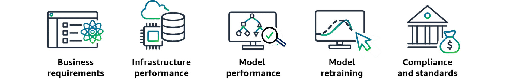

# Key Concepts: The Importance of Monitoring in ML

For a Senior ML Engineer, deploying a model is not the final step; it is the beginning of the operational lifecycle. Proactive, comprehensive monitoring is the only way to ensure that an ML system continues to deliver business value, remains reliable, and operates within ethical and technical boundaries. A failure to monitor is a failure to manage the asset.

---

### 1. The Five Pillars of ML Monitoring

A robust monitoring strategy is not monolithic. It must address five distinct, yet interconnected, domains:

-   **Business Performance Monitoring**: This is the ultimate measure of success. It answers the question: **"Is the model still achieving its business objective?"**
    -   **What to track**: Key Performance Indicators (KPIs) that are directly tied to business value. For a recommendation engine, this could be click-through rate, conversion rate, or average order value. For a fraud model, it's the dollar amount of fraud prevented versus the cost of false positives.
    -   **Senior Perspective**: A model can be technically perfect but fail to deliver business value. This layer of monitoring connects the ML system's performance directly to the company's bottom line and return on investment (ROI).

-   **Model Quality Monitoring**: This is the technical core of ML monitoring. It answers the question: **"Is the model still making accurate predictions?"**
    -   **What to track**: This involves monitoring for **model drift**, where the statistical properties of the model's predictions or the relationship between inputs and outputs change over time. This requires ground truth data to compare predictions against actual outcomes.
    -   **Key Metrics**: Accuracy, precision, recall, F1-score, AUC, etc.
    -   **Senior Perspective**: This is where services like **SageMaker Model Monitor** shine. It automates the process of comparing production predictions to a baseline, detecting degradation, and triggering alerts or retraining pipelines.

-   **Infrastructure & Hosting Monitoring**: This layer addresses the health of the underlying compute resources. It answers the question: **"Is the inference endpoint healthy and performant?"**
    -   **What to track**: System-level metrics for the SageMaker endpoint.
    -   **Key Metrics**: Latency (p50, p90, p99), error rates (4xx, 5xx), CPU/GPU utilization, memory usage, and invocation counts.
    -   **Senior Perspective**: This is standard operational monitoring, crucial for ensuring the service is available and meeting its Service Level Objectives (SLOs). Tools like **Amazon CloudWatch** are fundamental here for dashboards, alarms, and auto-scaling triggers.

-   **Facilitating Model Retraining**: Monitoring is the primary trigger for keeping models current. It answers the question: **"When should this model be retrained?"**
    -   **What to track**: Changes in data distribution (data drift) or a decline in prediction performance (model drift). For example, a customer churn model must be retrained as market conditions and customer behaviors evolve.
    -   **Senior Perspective**: A senior engineer designs the closed-loop system. Monitoring tools detect drift, which then automatically triggers a retraining pipeline (e.g., via EventBridge and Step Functions), ensuring the model adapts without manual intervention.

-   **Ensuring Compliance & Governance**: This pillar addresses legal, ethical, and regulatory requirements. It answers the question: **"Is the model operating fairly, securely, and transparently?"**
    -   **What to track**: Model bias (e.g., with SageMaker Clarify), data privacy, and access controls. This is especially critical in regulated industries like finance and healthcare.
    -   **Senior Perspective**: A senior engineer is responsible for implementing frameworks that protect user data, prevent unauthorized access, and ensure the model's decisions are explainable and fair, thereby building trust and accountability.

### 2. The AWS Well-Architected Framework: ML Lens

The AWS Well-Architected Framework provides a set of best practices for building in the cloud. The **Machine Learning Lens** specifically adapts these principles for ML workloads, emphasizing a culture of continuous improvement.

-   **Enable Continuous Improvement**: This is the core principle that drives monitoring. An ML system is not static. You must establish feedback loops to analyze performance, identify areas for improvement, and automate the process of iteration.
-   **Monitor Performance**: Use tools like **SageMaker Model Monitor** and **SageMaker Model Dashboard** to continuously assess models for drift and degradation. Configure **CloudWatch Alarms** to provide immediate notifications.
-   **Automate Retraining**: The monitoring system should not be passive. Use **Amazon EventBridge** to create rules that automatically trigger a retraining pipeline (e.g., a Step Functions workflow) when a monitor detects a significant issue. This creates a closed-loop system that allows the model to adapt to changing data patterns.
-   **Optimize Resources & Reduce Cost**: Monitoring is essential for cost optimization. By tracking resource utilization (CPU, GPU, memory) of your endpoints, you can right-size instances and configure auto-scaling policies to match demand, preventing over-provisioning and minimizing waste.

### 3. Key AWS Services for Monitoring

-   **Amazon SageMaker Model Monitor**: The primary tool for automatically detecting data quality issues and model drift.
-   **Amazon SageMaker Clarify**: Used to detect and monitor for bias in data and models, and to provide feature attributions for model explainability.
-   **Amazon SageMaker Model Dashboard**: A centralized dashboard to view the status and performance of all your deployed models.
-   **Amazon CloudWatch**: The foundational service for collecting metrics, creating dashboards, setting alarms, and logging.
-   **Amazon EventBridge**: The event bus that connects your monitoring services to automated actions, such as triggering a Lambda function or a Step Functions workflow.